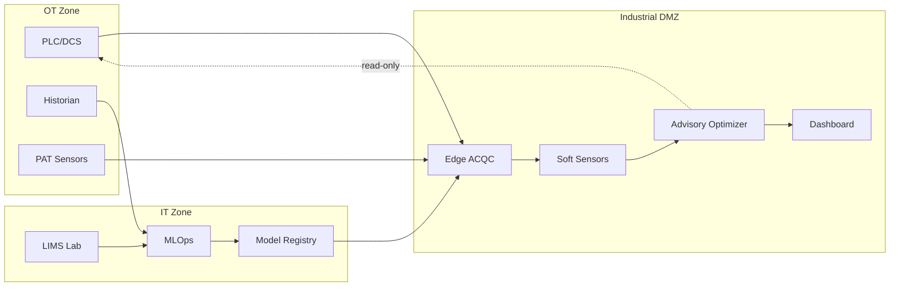

# ACQC — Adaptive Circular Quality Control (Repsol Puertollano)

[](https://github.com/tangodelta217/ACQC/actions/workflows/ci.yml)
[](https://tangodelta217.github.io/ACQC/)

Arquitectura **operable** en entorno industrial: *soft sensors* + validación + **optimización advisory** + **MLOps** + **ciberdefensa OT**.

> Alcance explícito: **solo lectura + recomendación**. No se realiza control en lazo cerrado ni escritura a PLC/DCS salvo procedimiento formal (MOC) fuera del alcance.

---

## Navegación rápida 

- **Arquitectura end-to-end (diagrama + vistas)** → [`docs/01_Architecture/ARCHITECTURE_PORTAL.md`](docs/01_Architecture/ARCHITECTURE_PORTAL.md)
- **Entregables PDF + Business Case ROI** → [`docs/00_Deliverables/`](docs/00_Deliverables/)
- **Single Source of Truth (SSOT)** (tags, requisitos, KPIs, riesgos) → [`ssot/`](ssot/)
- **Runbooks (operación/fallback/incidentes)** → [`runbooks/`](runbooks/)

---

## Arquitectura at a glance



---

## Entregables (PDF/Excel)

| Artefacto | Ruta |
|---|---|
| One-Pager (visión ejecutiva) | `docs/00_Deliverables/ACQC_OnePager.pdf` |
| SAD / Arquitectura (vistas + requisitos) | `docs/00_Deliverables/ACQC_Arquitectura.pdf` |
| Plan de Validación QA (laboratorio) | `docs/00_Deliverables/ACQC_Validacion.pdf` |
| Dossier Soft Sensors (robustez/edge) | `docs/00_Deliverables/ACQC_SoftSensors.pdf` |
| Dossier Optimización Segura (advisory) | `docs/00_Deliverables/ACQC_Optimizacion.pdf` |
| MLOps & Gobernanza (repro/auditoría) | `docs/00_Deliverables/ACQC_MLOps.pdf` |
| OT Cyber Defensivo (IEC 62443 / NIST) | `docs/00_Deliverables/ACQC_Ciberseguridad.pdf` |
| Business Case ROI (Excel) | `docs/00_Deliverables/09_BusinessCase_ROI_mejorado.xlsx` |

---

## Business Case 

> Los gráficos siguientes se generan a partir de los supuestos del Excel (no son mediciones).  
> Detalle y trazabilidad: `docs/00_Deliverables/09_BusinessCase_ROI_mejorado.xlsx`.

**NPV por escenario**


**Payback por escenario**


**Sensibilidad ±20% (5 supuestos clave)**


---

## Demo local 

Esqueleto ejecutable mínimo con datos sintéticos para demostración técnica.

### Ejecución rápida

```powershell
cd C:\Users\User\Desktop\ACQC\src

# Ejecutar demo (Python 3.10+ requerido)
python -m acqc_demo

# Opciones
python -m acqc_demo -n 200 -v    # 200 samples, verbose
python -m acqc_demo -o ./out     # Directorio de salida
```

### Qué hace

1. **Genera datos sintéticos** — Tags de proceso con ruido y QC flags
2. **Ejecuta soft sensor** — Modelo lineal baseline con incertidumbre
3. **Detecta OOD** — Marca predicciones fuera de rango
4. **Genera audit log** — Trazabilidad completa

### Tests

```powershell
cd src
pip install pytest
pytest tests/ -v
```

Ver [`src/README.md`](src/README.md) para documentación completa.

---

## Estructura del repositorio 

- `docs/` → portal de lectura (arquitectura, operación, gobernanza, seguridad, entregables).
- `src/` → código de referencia (demo ejecutable con datos sintéticos).
- `ssot/` → artefactos maestros: **tags**, **variables de calidad**, **requisitos**, **KPIs**, **riesgos**.
- `schemas/` → contratos de datos (JSON Schema).
- `runbooks/` → operación, fallback, incidentes (modo planta).
- `scripts/` → scripts de utilidad.

---


