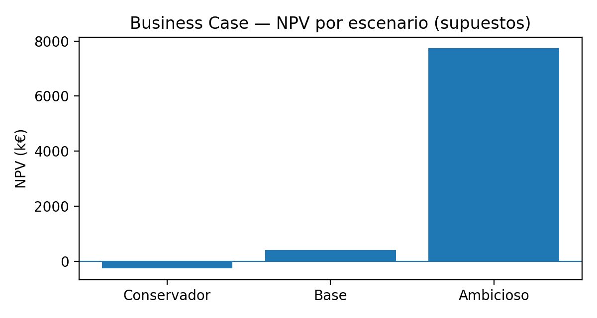
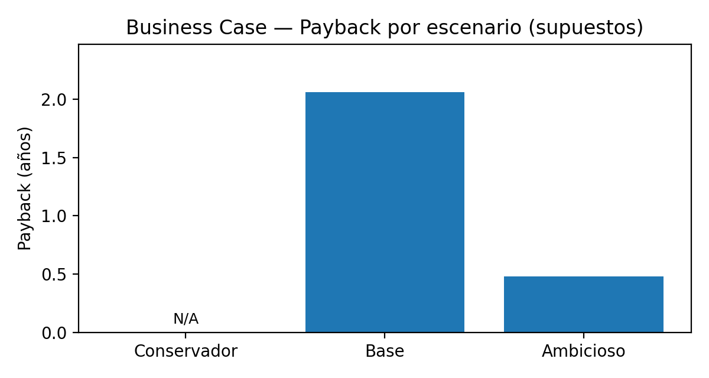
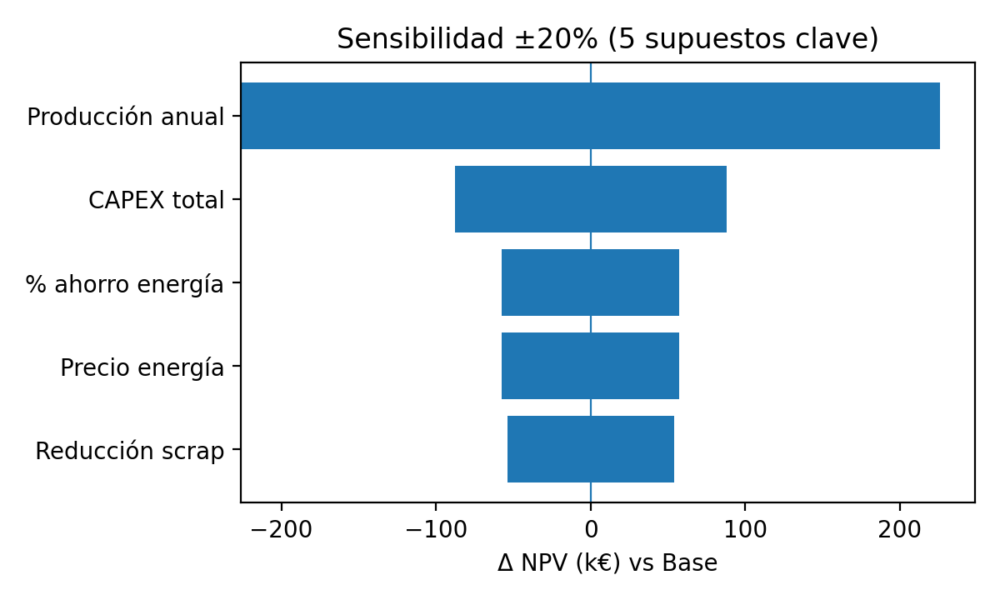

# ACQC — Adaptive Circular Quality Control (Repsol Puertollano)

[](https://github.com/tangodelta217/ACQC/actions/workflows/ci.yml)
[](https://tangodelta217.github.io/ACQC/)

Arquitectura **operable** en entorno industrial: *soft sensors* + validación + **optimización advisory** + **MLOps** + **ciberdefensa OT**.

> Alcance explícito: **solo lectura + recomendación**. No se realiza control en lazo cerrado ni escritura a PLC/DCS salvo procedimiento formal (MOC) fuera del alcance.

---

## Navegación rápida (para “wow” en 60 segundos)

- **Arquitectura end-to-end (diagrama + vistas)** → [`docs/01_Architecture/ARCHITECTURE_PORTAL.md`](docs/01_Architecture/ARCHITECTURE_PORTAL.md)
- **Entregables PDF + Business Case ROI** → [`docs/00_Deliverables/`](docs/00_Deliverables/)
- **Single Source of Truth (SSOT)** (tags, requisitos, KPIs, riesgos) → [`ssot/`](ssot/)
- **Runbooks (operación/fallback/incidentes)** → [`runbooks/`](runbooks/)

---

## Arquitectura “at a glance” (OT/DMZ/IT + módulos)

```mermaid
flowchart LR
  %% =========================
  %% Zonas / Trust boundaries
  %% =========================
  subgraph OT["OT (Purdue L0–L3) — fuentes en solo lectura"]
    direction TB
    PLC["PLC/DCS\n(tags de proceso)"]
    HIST["Historian (p.ej. OSIsoft PI)\nseries temporales"]
    PAT["PAT NIR/Raman\n(espectros)"]
  end

  subgraph DMZ["Industrial DMZ / Edge Zone"]
    direction TB
    EDGE["Nodo Edge ACQC\n(PC industrial o Jetson Orin)\nSecure Boot + root of trust"]
    ING["Ingesta\nOPC UA / conector historian\n+ PAT adapter"]
    QC["Data contracts\n(unidades, rangos, calidad)"]
    FE["Feature builder\n(alineación temporal)"]
    SS["Soft Sensors (inferencia)\nONNX Runtime (+TensorRT)"]
    UNK["Incertidumbre\n(intervalos calibrados)"]
    DR["Drift/OOD + salud sensor\n(QC espectral, PSI, residuales)"]
    OPT["Optimización segura (advisory)\nrestricciones + 'no recomendar'"]
    UI["Dashboard/HMI\n(evidencia + auditoría)"]
    OBS["Observabilidad y logs\n(métricas + trazas)"]
    EDGE --> ING --> QC --> FE --> SS --> UNK --> DR --> OPT --> UI
    SS --> UI
    DR --> UI
    OPT --> OBS
    SS --> OBS
    DR --> OBS
  end

  subgraph IT["IT / Analytics Zone"]
    direction TB
    LIMS["Laboratorio / LIMS\n(ground truth)"]
    MLO["MLOps & gobernanza\nGit + DVC + MLflow\nCI/CD con gates"]
    REG["Registry\n(paquetes firmados)\n+ rollback"]
    SIEM["SIEM / SOC\n(correlación de eventos)"]
    ROI["Business Case\nROI / sensibilidad"]
    MLO --> REG
  end

  subgraph PEOPLE["Usuarios"]
    direction TB
    OP["Operador/a\n(acepta/rechaza)"]
    QA["Calidad/Lab\n(muestreo/validación)"]
    SEC["OT/IT Security\n(hardening, accesos)"]
    MGMT["Gestión\n(ROI y roadmap)"]
  end

  %% =========================
  %% Flujos
  %% =========================
  PLC -->|OPC UA (read-only)| ING
  PAT -->|espectros| ING

  HIST -->|histórico| MLO
  LIMS -->|resultados lab| MLO

  MLO -->|export ONNX + model card| REG -->|deploy a DMZ| EDGE
  OBS -->|logs| SIEM

  UI --> OP
  ROI --> MGMT
  QA --> LIMS
  SEC --> SIEM

  %% =========================
  %% Fuera de alcance (control)
  %% =========================
  OPT -.->|NO writeback\n(fuera de alcance TFM)| PLC
```

---

## Entregables (PDF/Excel)

| Artefacto | Ruta |
|---|---|
| One-Pager (visión ejecutiva) | `docs/00_Deliverables/ACQC_OnePager.pdf` |
| SAD / Arquitectura (vistas + requisitos) | `docs/00_Deliverables/ACQC_Arquitectura.pdf` |
| Plan de Validación QA (laboratorio) | `docs/00_Deliverables/ACQC_Validacion.pdf` |
| Dossier Soft Sensors (robustez/edge) | `docs/00_Deliverables/ACQC_SoftSensors.pdf` |
| Dossier Optimización Segura (advisory) | `docs/00_Deliverables/ACQC_Optimizacion.pdf` |
| MLOps & Gobernanza (repro/auditoría) | `docs/00_Deliverables/ACQC_MLOps.pdf` |
| OT Cyber Defensivo (IEC 62443 / NIST) | `docs/00_Deliverables/ACQC_Ciberseguridad.pdf` |
| Business Case ROI (Excel) | `docs/00_Deliverables/09_BusinessCase_ROI_mejorado.xlsx` |

---

## Business Case (snapshot visual)

> Los gráficos siguientes se generan a partir de los supuestos del Excel (no son mediciones).  
> Detalle y trazabilidad: `docs/00_Deliverables/09_BusinessCase_ROI_mejorado.xlsx`.

**NPV por escenario**



**Payback por escenario**



**Sensibilidad ±20% (5 supuestos clave)**



---

## Demo local (opcional)

Esqueleto ejecutable mínimo con datos sintéticos para demostración técnica.

### Ejecución rápida

```powershell
cd C:\Users\User\Desktop\ACQC\src

# Ejecutar demo (Python 3.10+ requerido)
python -m acqc_demo

# Opciones
python -m acqc_demo -n 200 -v    # 200 samples, verbose
python -m acqc_demo -o ./out     # Directorio de salida
```

### Qué hace

1. **Genera datos sintéticos** — Tags de proceso con ruido y QC flags
2. **Ejecuta soft sensor** — Modelo lineal baseline con incertidumbre
3. **Detecta OOD** — Marca predicciones fuera de rango
4. **Genera audit log** — Trazabilidad completa

### Tests

```powershell
cd src
pip install pytest
pytest tests/ -v
```

Ver [`src/README.md`](src/README.md) para documentación completa.

---

## Estructura del repositorio (mapa)

- `docs/` → portal de lectura (arquitectura, operación, gobernanza, seguridad, entregables).
- `src/` → código de referencia (demo ejecutable con datos sintéticos).
- `ssot/` → artefactos maestros: **tags**, **variables de calidad**, **requisitos**, **KPIs**, **riesgos**.
- `schemas/` → contratos de datos (JSON Schema).
- `runbooks/` → operación, fallback, incidentes (modo planta).
- `scripts/` → scripts de utilidad.

---

## Nota de confidencialidad

Este repositorio evita incluir datos reales de proceso o identificadores sensibles.  
Los nombres de tags, valores numéricos y endpoints son **plantillas** y deben adaptarse a la realidad de planta con aprobación OT/IT.

