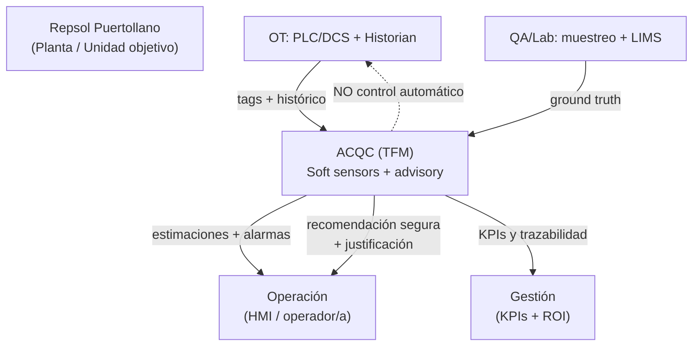
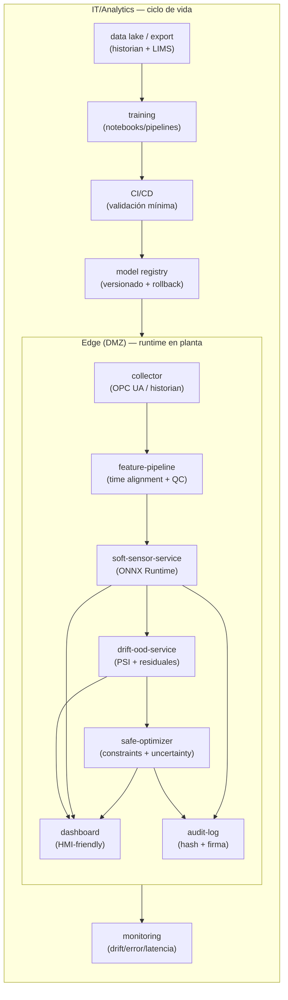
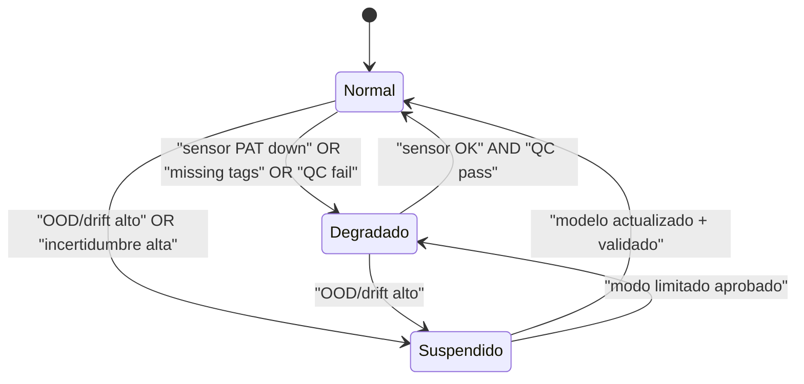
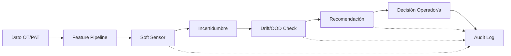

# Arquitectura end-to-end (portal)

Este documento está diseñado para lectura en GitHub con **diagramas Mermaid**.  
La intención es que una persona de OT/IT/QA pueda comprender el sistema en pocos minutos, y que una persona de gestión vea el “por qué” (ROI) sin entrar en detalle.

---

## 1) Contexto del sistema (qué entra / qué sale)



**Entrada principal**
- Tags de proceso (PLC/DCS/historian) en modo **solo lectura**.
- Señales PAT (p.ej., NIR/Raman) cuando existen; si no, el diseño permite comenzar sin PAT.

**Salida principal**
- Estimaciones de variables de calidad con incertidumbre.
- Estado de salud del sistema (drift/OOD, calidad de dato, sensor health).
- Recomendación en modo **advisory** (human-in-the-loop) con justificación.

---

## 2) Vista de contenedores (qué corre y dónde)



---

## 3) Vista de despliegue (OT/DMZ/IT)

```mermaid
flowchart TB
  subgraph OT["OT (Purdue L0–L3)"]
    PLC["PLC/DCS"]
    HIS["Historian"]
    PAT["PAT (NIR/Raman)\n(opcional)"]
  end

  subgraph DMZ["Industrial DMZ / Edge"]
    EDGE["Nodo Edge\n(Docker)"]
    FW["Firewall (allowlist)"]
  end

  subgraph IT["IT (zona analítica)"]
    REG["Repo/Registry\n(artefactos firmados)"]
    SIEM["SIEM/SOC"]
    LIMS["LIMS"]
  end

  PLC -->|OPC UA (read-only)\nmutual TLS| EDGE
  PAT -->|canal dedicado\n+ autenticación| EDGE
  HIS -->|export controlado\n(ventanas)| REG
  LIMS -->|resultados| REG

  REG -->|deploy firmado\n+ verificación| EDGE
  EDGE -->|logs/alertas| SIEM

  FW --- EDGE
```

Notas operativas:
- **Segmentación**: el runtime se ubica en DMZ para reducir superficie de ataque OT.
- **Sin escritura** a PLC/DCS en alcance TFM.
- Integración con historian y LIMS mediante export/ETL controlado cuando no sea viable conectividad directa.

---

## 4) Secuencia de operación (runtime)

```mermaid
sequenceDiagram
  participant PLC as PLC/DCS
  participant Edge as Edge collector
  participant FE as Feature pipeline
  participant SS as Soft sensor
  participant DR as Drift/OOD
  participant OPT as Safe optimizer
  participant UI as Dashboard
  participant LOG as Audit log

  PLC->>Edge: tags (read-only)
  Edge->>FE: ventana de datos + QC flags
  FE->>SS: features
  SS-->>FE: y_hat + uncertainty
  FE->>DR: stats (inputs/outputs)
  DR-->>FE: status (OK / Degradado / OOD)

  alt Status OK
    FE->>OPT: contexto + constraints + uncertainty
    OPT-->>UI: recomendación + justificación
  else Status no OK
    FE-->>UI: "no recomendar" + motivo
  end

  SS-->>UI: calidad estimada (con bandas)
  DR-->>UI: alarmas / salud sensor
  UI-->>LOG: decisión operador (acepta/rechaza)
  FE-->>LOG: evento de inferencia (hash modelo + data window)
```

---

## 5) Máquina de estados (fallback / seguridad)



Definición operacional:
- **Normal**: estimación + recomendación habilitada.
- **Degradado**: estimación habilitada (con aviso), recomendación limitada o deshabilitada según criticidad.
- **Suspendido**: solo monitorización; recomendación bloqueada; requiere investigación y/o rollback.

---

## 6) Ciclo de vida MLOps (reproducibilidad y auditoría)

```mermaid
flowchart LR
  D[(Historian + LIMS)] --> V["Data validation\n(schema + rangos + unidades)"]
  V --> VC["Versionado\n(DVC/artefactos)"]
  VC --> TR["Train\n(PLS/PCR → árboles → redes)"]
  TR --> EV["Evaluación offline\n(split temporal + lotes)"]
  EV --> G{Gate\nKPI mínimos}
  G -- NO --> RCA["Análisis de error\n+ mejora features"] --> V
  G -- SÍ --> PKG["Paquete\n(ONNX + metadata)"]
  PKG --> SIGN["Firma\n(modelo+config)"]
  SIGN --> APP{Aprobación\nOT/QA}
  APP -- OK --> DEP["Deploy\nDMZ edge"]
  APP -- NO --> RCA
  DEP --> MON["Monitor\n(drift/error/latencia)"]
  MON --> TRG{Trigger\n(retrain/rollback)}
  TRG -- retrain --> V
  TRG -- rollback --> DEP
```

---

## 7) Traceability Story (dato → decisión)

El flujo completo de trazabilidad permite auditar cualquier recomendación:



| Paso | Qué se registra | Dónde |
|------|-----------------|-------|
| **Dato** | Timestamp, tag, valor, QC flag | Edge collector |
| **Feature** | Ventana, alineación, transformaciones | Feature pipeline |
| **Predicción** | y_hat, intervalo, modelo ID, hash | Soft sensor service |
| **Drift** | PSI, residuales, OOD score | Drift service |
| **Recomendación** | Acción sugerida, restricciones, justificación | Safe optimizer |
| **Decisión** | Acepta/rechaza, timestamp, operador ID | Audit log |

---

## 8) Artefactos SSOT

Los artefactos maestros viven en `ssot/`:

| Archivo | Propósito |
|---------|-----------|
| `tag_dictionary_template.csv` | Diccionario de tags OT/PAT |
| `quality_variables.csv` | Variables de calidad objetivo |
| `requirements_matrix.csv` | Requisitos trazables |
| `kpi_acceptance.csv` | Criterios de aceptación |
| `risk_register.csv` | Riesgos y mitigaciones |

---

## 9) Referencias

- **Entregables PDF/Excel**: [`../00_Deliverables/`](../00_Deliverables/)
- **Runbooks operativos**: `runbooks/`

