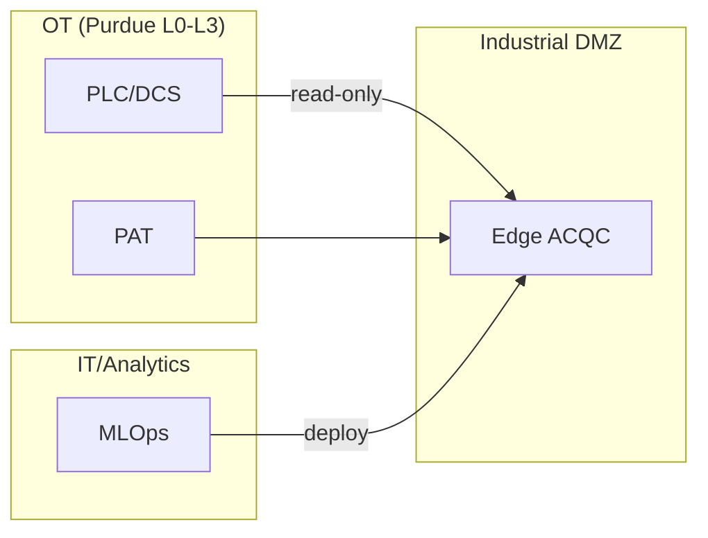

# Arquitectura

Portal de arquitectura del sistema ACQC.

---

## Documentación

- [**Portal de Arquitectura**](ARCHITECTURE_PORTAL.md) — Vista completa: contexto, contenedores, despliegue, secuencias, estados y MLOps.

---

## Diagrama resumen

---

## Entregable relacionado

📄 [ACQC_Arquitectura.pdf](../00_Deliverables/ACQC_Arquitectura.pdf)
