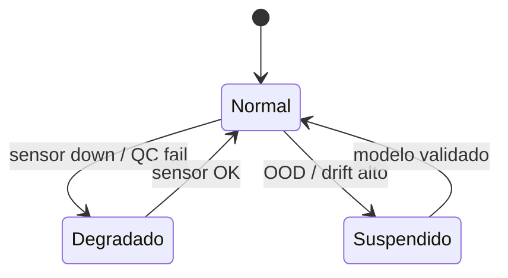

# Operaciones

Guías operativas y demo story del sistema ACQC.

---

## Documentación

- [**Demo Story**](DEMO_STORY.md) — Narrativa de demostración del sistema.

---

## Runbooks

Los runbooks operativos se encuentran en `runbooks/`:

- **Incident Response** (`runbooks/INCIDENT_RESPONSE.md`) — Procedimiento de respuesta a incidentes.

---

## Estados operacionales

| Estado | Descripción |
|--------|-------------|
| **Normal** | Estimación + recomendación habilitada |
| **Degradado** | Estimación con aviso, recomendación limitada |
| **Suspendido** | Solo monitorización, requiere investigación |
