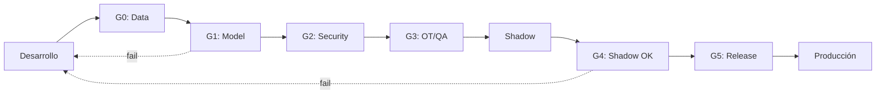

# Gobernanza MLOps

> Marco de gobernanza para el ciclo de vida de modelos en entorno industrial.

Este resumen acompaña al entregable [`ACQC_MLOps.pdf`](../00_Deliverables/ACQC_MLOps.pdf).

---

## Principios

| Principio | Descripción |
|-----------|-------------|
| **Reproducibilidad** | Entorno, código, datos y config versionados |
| **Trazabilidad** | Data → modelo → predicción → recomendación → decisión |
| **Rollback** | Última versión aprobada siempre disponible |
| **Gates** | Aprobación OT/QA antes de deploy a DMZ |

---

## Tabla de Gates

| Gate | Nombre | Qué se valida | Evidencia esperada | Responsable |
|------|--------|---------------|-------------------|-------------|
| **G0** | Data Quality | Datos de entrada cumplen schema y rangos | Data validation report | Data Engineer |
| **G1** | Model Performance | KPIs offline cumplen umbrales | Eval report vs holdout | ML Engineer |
| **G2** | Security Review | Artefactos firmados, sin vulnerabilidades | Scan report + firma | Security |
| **G3** | OT/QA Approval | Validación funcional y de proceso | Sign-off documentado | OT Lead + QA |
| **G4** | Shadow Validation | Comparación shadow vs producción | Shadow report (N días) | Ops + ML |
| **G5** | Production Release | Todos los gates anteriores OK | Release checklist | Release Manager |

---

## Artefactos versionados

| Tipo | Qué se versiona | Herramienta sugerida |
|------|-----------------|---------------------|
| Código | Pipelines, features, inferencia | Git |
| Datos | Metadatos + hashes (sin datos sensibles) | DVC / MLflow |
| Modelos | Export ONNX + model card | MLflow Registry |
| Config | Rangos, unidades, thresholds | Git + JSON Schema |
| Entorno | Dockerfile, lockfiles | Git + Container Registry |

---

## Flujo de release

---

## Criterios de aceptación

Los KPIs mínimos para pasar gates se definen en `ssot/kpi_acceptance.csv`.

| KPI | Umbral típico | Notas |
|-----|---------------|-------|
| MAE vs lab | < X unidades | Definir por variable |
| Cobertura intervalo | ≥ 90% | Incertidumbre calibrada |
| Drift detection rate | ≥ 95% | Detectar cambios de régimen |
| Latencia p99 | < Y ms | Según requisito OT |

---

## Rollback

En caso de degradación detectada en producción:

1. **Alerta**: Drift/error monitoring dispara notificación
2. **Freeze**: Se congela recomendación automáticamente
3. **Rollback**: Deploy de última versión aprobada (G5 anterior)
4. **RCA**: Análisis de causa raíz documentado
5. **Fix**: Nuevo ciclo desde G0

---

## Referencias

- **Entregable PDF**: [`ACQC_MLOps.pdf`](../00_Deliverables/ACQC_MLOps.pdf)
- **KPIs de aceptación**: `ssot/kpi_acceptance.csv`
- **Risk register**: `ssot/risk_register.csv`
