# Governance & MLOps

Marco de gobernanza y ciclo de vida MLOps del sistema ACQC.

---

## Documentación

- [**Gobernanza MLOps**](GOVERNANCE.md) — Principios, artefactos versionados y flujos mínimos.

---

## Ciclo de vida

```mermaid
flowchart LR
  D[(Data)] --> V["Validación"]
  V --> TR["Train"]
  TR --> EV["Evaluación"]
  EV --> G{Gate}
  G -->|SÍ| PKG["Paquete"]
  G -->|NO| RCA["Análisis"]
  RCA --> V
  PKG --> DEP["Deploy"]
  DEP --> MON["Monitor"]
```

---

## Principios clave

| Principio | Descripción |
|-----------|-------------|
| **Reproducibilidad** | Entorno, código, datos, config versionados |
| **Trazabilidad** | Data → modelo → predicción → decisión |
| **Rollback seguro** | Última versión aprobada siempre disponible |
| **Gates** | Aprobación OT/QA antes de deploy |

---

## Entregable relacionado

📄 [ACQC_MLOps.pdf](../00_Deliverables/ACQC_MLOps.pdf)
