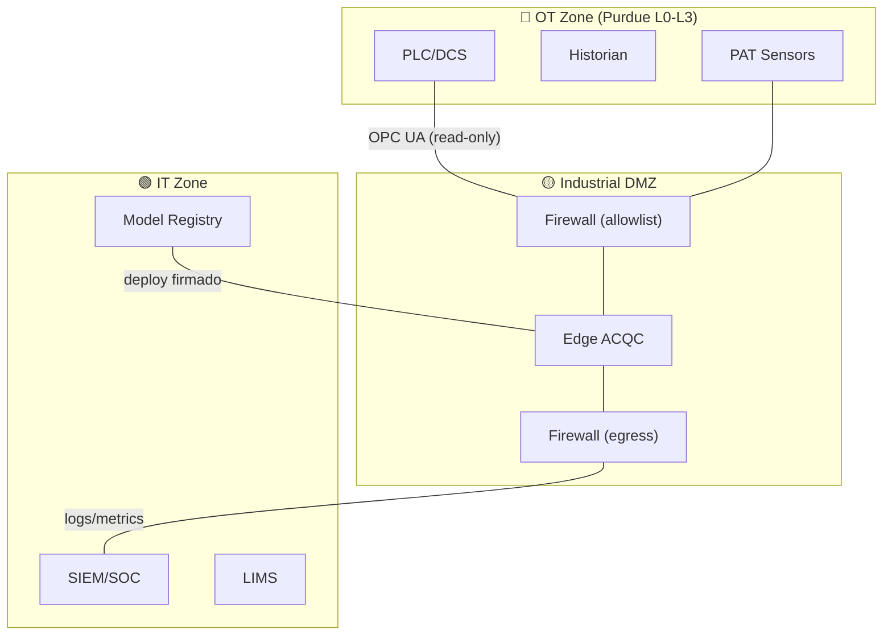
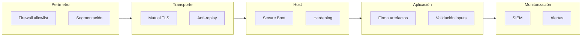

# OT Cyber Defensivo

> Postura de seguridad para sistemas de inferencia en entorno industrial OT.

Este resumen acompaña al entregable [`ACQC_Ciberseguridad.pdf`](../00_Deliverables/ACQC_Ciberseguridad.pdf).

---

## Trust Boundaries

| Zona | Trust Level | Qué contiene |
|------|-------------|--------------|
| **OT** | Máximo | PLCs, DCS, Historian, sensores |
| **DMZ** | Medio | Edge runtime, inferencia |
| **IT** | Estándar | MLOps, Registry, SIEM |

---

## Threat Model

| ID | Amenaza | Vector | Impacto | Probabilidad |
|----|---------|--------|---------|--------------|
| T1 | **Spoofing de señales** | Inyección de datos falsos en OPC UA | Predicciones incorrectas | Media |
| T2 | **Replay attack** | Retransmisión de valores históricos | Evasión de drift detection | Media |
| T3 | **Model tampering** | Modificación de artefactos ONNX | Recomendaciones maliciosas | Baja |
| T4 | **Unauthorized access** | Acceso al edge sin credenciales | Exfiltración o sabotaje | Media |
| T5 | **Denial of Service** | Saturación de recursos edge | Pérdida de estimación | Baja |
| T6 | **Config manipulation** | Cambio de thresholds/rangos | Bypass de alertas | Baja |

---

## Controles Defensivos

| Control | Amenazas mitigadas | Implementación |
|---------|-------------------|----------------|
| **Segmentación OT/DMZ/IT** | T4, T5 | Firewalls con allowlist, VLANs |
| **Mutual TLS** | T1, T4 | Certificados para OPC UA |
| **Secure Boot** | T3, T6 | Root of trust en edge |
| **Firma de artefactos** | T3, T6 | Hash + firma de modelo y config |
| **Anti-replay** | T2 | Timestamps + nonces + ventana |
| **Rate limiting** | T5 | Límites en edge y firewalls |
| **Hardening** | T4, T5 | Servicios mínimos, no root |
| **Logging centralizado** | Todos | Exportación a SIEM |

---

## Mapa de controles por capa

---

## Operación de seguridad

| Actividad | Frecuencia | Responsable |
|-----------|------------|-------------|
| Rotación de certificados | Anual o según política | Security |
| Gestión de parches | Según ventana OT | OT + Security |
| Revisión de logs SIEM | Continua | SOC |
| Pen testing (si aplica) | Anual | Security externo |
| Actualización de allowlists | Según cambios | OT + Security |

---

## Respuesta a incidentes

1. **Detección**: Alerta de SIEM o drift anómalo
2. **Contención**: Congelado automático de recomendaciones
3. **Aislamiento**: Si es necesario, desconexión del edge
4. **Análisis**: Logs + forense según procedimiento
5. **Recuperación**: Rollback a última versión validada
6. **Lecciones**: Actualización de controles y risk register

---

## Frameworks de referencia

| Framework | Aplicación |
|-----------|------------|
| **IEC 62443** | Seguridad en sistemas de automatización industrial |
| **NIST CSF** | Identify, Protect, Detect, Respond, Recover |
| **Purdue Model** | Segmentación de zonas OT/IT |

---

## Referencias

- **Entregable PDF**: [`ACQC_Ciberseguridad.pdf`](../00_Deliverables/ACQC_Ciberseguridad.pdf)
- **Risk register**: `ssot/risk_register.csv`
- **Runbook de incidentes**: `runbooks/INCIDENT_RESPONSE.md`
