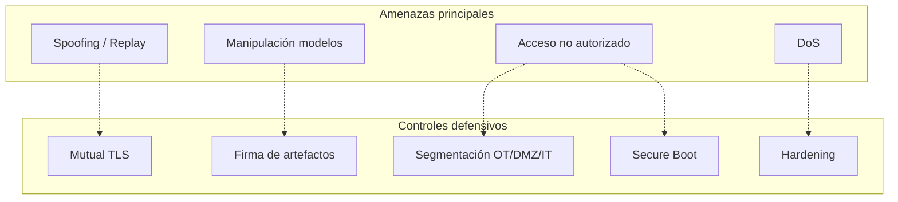

# Seguridad OT

Ciberseguridad defensiva para entornos industriales OT/IT.

---

## Documentación

- [**OT Cyber Defensivo**](SECURITY.md) — Threat model y controles recomendados.

---

## Modelo de amenazas (resumen)

---

## Frameworks de referencia

- **IEC 62443** — Seguridad en sistemas de automatización industrial
- **NIST CSF** — Cybersecurity Framework

---

## Entregable relacionado

📄 [ACQC_Ciberseguridad.pdf](../00_Deliverables/ACQC_Ciberseguridad.pdf)
