# Seguridad OT

Ciberseguridad defensiva para entornos industriales OT/IT.

---

## Documentación

- [**OT Cyber Defensivo**](SECURITY.md) — Threat model y controles recomendados.

---

## Modelo de amenazas (resumen)

```mermaid
flowchart TB
  subgraph Amenazas["Amenazas principales"]
    A1["Spoofing / Replay"]
    A2["Manipulación modelos"]
    A3["Acceso no autorizado"]
    A4["DoS"]
  end
  
  subgraph Controles["Controles defensivos"]
    C1["Segmentación OT/DMZ/IT"]
    C2["Mutual TLS"]
    C3["Secure Boot"]
    C4["Firma de artefactos"]
    C5["Hardening"]
  end
  
  A1 -.-> C2
  A2 -.-> C4
  A3 -.-> C1
  A3 -.-> C3
  A4 -.-> C5
```

---

## Frameworks de referencia

- **IEC 62443** — Seguridad en sistemas de automatización industrial
- **NIST CSF** — Cybersecurity Framework

---

## Entregable relacionado

📄 [ACQC_Ciberseguridad.pdf](../00_Deliverables/ACQC_Ciberseguridad.pdf)
