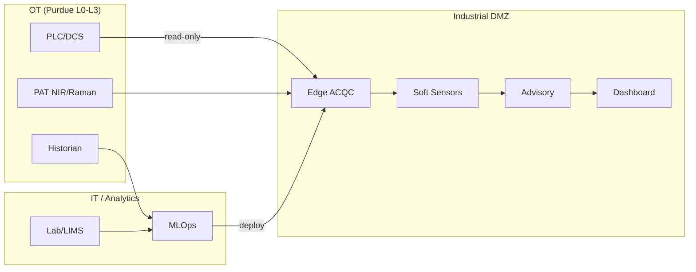

# ACQC — Adaptive Circular Quality Control

> Sistema de **estimación online de calidad** y **recomendación segura** para operaciones industriales con materias primas circulares.

---

## Qué es ACQC

- **Soft sensors** para estimar variables de calidad en tiempo real (sin esperar laboratorio).
- **Incertidumbre calibrada** para cada estimación (saber cuándo confiar).
- **Detección de drift/OOD** para identificar cambios de régimen operacional.
- **Optimización en modo advisory** (human-in-the-loop): recomienda, no actúa.
- **Gobernanza MLOps** completa: versionado, gates, rollback, auditoría.
- **Ciberdefensa OT** alineada con IEC 62443 y NIST CSF.

---

## Qué NO es ACQC

!!! warning "Fuera de alcance"

| Exclusión | Motivo |
|-----------|--------|
| Control en lazo cerrado | Solo lectura de OT; sin escritura a PLC/DCS |
| Sustitución del laboratorio | Complementa, no reemplaza la validación QA |
| Sistema autónomo | Operador/a decide; el sistema solo recomienda |
| Resultados medidos en producción | Proyecto TFM; solo resultados esperados y plan de validación |

---

## Navegación en 2 minutos

| # | Sección | Qué encontrar | Enlace |
|---|---------|---------------|--------|
| 1 | **Arquitectura** | Diagramas OT/DMZ/IT, vistas, trazabilidad | [→ Portal](01_Architecture/ARCHITECTURE_PORTAL.md) |
| 2 | **Operaciones** | Demo story, estados, runbooks | [→ Ops](02_Operations/index.md) |
| 3 | **Governance** | MLOps, gates, evidencias, rollback | [→ MLOps](03_Governance/index.md) |
| 4 | **Seguridad** | Threat model, controles, trust boundaries | [→ Security](04_Security/index.md) |
| 5 | **Business Case** | NPV, payback, sensibilidad | [→ ROI](05_BusinessCase/README.md) |
| 6 | **Entregables** | PDFs y Excel | [→ Deliverables](00_Deliverables/README.md) |

---

## Arquitectura at a glance

**Flujo de valor**: Dato OT → Feature pipeline → Soft sensor → Incertidumbre → Drift check → Recomendación → Decisión operador/a → Auditoría.

---

## Trazabilidad (SSOT)

Los artefactos maestros garantizan coherencia entre documentación, código y entregables:

| Artefacto | Propósito | Ubicación |
|-----------|-----------|-----------|
| Tag Dictionary | Variables OT y PAT | `ssot/tag_dictionary_template.csv` |
| Quality Variables | Variables de calidad objetivo | `ssot/quality_variables.csv` |
| Requirements Matrix | Requisitos trazables | `ssot/requirements_matrix.csv` |
| KPI Acceptance | Criterios de aceptación | `ssot/kpi_acceptance.csv` |
| Risk Register | Riesgos y mitigaciones | `ssot/risk_register.csv` |

---

## Entregables

| Documento | Descripción |
|-----------|-------------|
| [One-Pager](00_Deliverables/ACQC_OnePager.pdf) | Visión ejecutiva (1 página) |
| [Arquitectura](00_Deliverables/ACQC_Arquitectura.pdf) | SAD + vistas + requisitos |
| [Soft Sensors](00_Deliverables/ACQC_SoftSensors.pdf) | Dossier técnico |
| [Optimización](00_Deliverables/ACQC_Optimizacion.pdf) | Advisory mode |
| [MLOps](00_Deliverables/ACQC_MLOps.pdf) | Gobernanza |
| [Ciberseguridad](00_Deliverables/ACQC_Ciberseguridad.pdf) | IEC 62443 / NIST |
| [Validación](00_Deliverables/ACQC_Validacion.pdf) | Plan QA vs laboratorio |
| [Business Case](00_Deliverables/09_BusinessCase_ROI_mejorado.xlsx) | NPV, Payback, Sensibilidad |

---

## Recursos adicionales

- **Runbooks**: Procedimientos operativos → `runbooks/`
- **Schemas**: Contratos de datos JSON → `schemas/`
